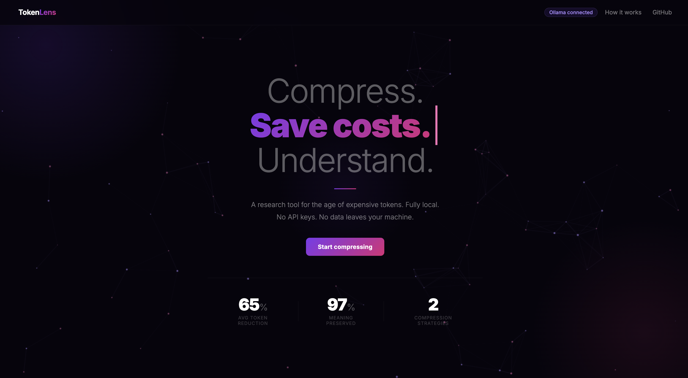

# TokenLens

> The only tool that shows you exactly how much meaning you lose when you compress an LLM prompt.



---

## What is TokenLens?

Every time you send a long document to an AI model, you pay per token. A 10,000-token prompt costs 10x more than a 1,000-token one. Companies like Google, Meta, and Microsoft spend millions on this problem at scale.

TokenLens compresses long prompts using two strategies, then scientifically measures how much meaning was preserved. It gives you a quality score, a side by side answer comparison, and exact token savings — so you can make informed decisions about how aggressively to compress.

**This is not a chatbot wrapper. This is a research and benchmarking tool.**

---

## Results

```
Input document        →   2,800 tokens
After compression     →   700 tokens
Tokens saved          →   2,100  (75% reduction)
──────────────────────────────────────────────
Semantic similarity   →   98%    meaning preserved
ROUGE-L               →   61%    word overlap
Combined score        →   79%    overall quality
──────────────────────────────────────────────
Cost implication      →   75% cheaper to run at scale
```

> Compressed 75% of tokens while preserving 98% of meaning.
> On a production system processing 1M documents/day, that is roughly $22,500 saved daily vs uncompressed prompts.

---

## Features

- Two compression strategies — Extractive (embedding-based) and Abstractive (LLM summarization)
- Quality evaluation pipeline — ROUGE-L + semantic similarity scored against a full-context baseline
- Side by side answer comparison — see exactly what was preserved and what was lost
- File upload — drag and drop .txt, .pdf, or .md files
- Interactive particle background — particles react to your cursor in real time
- Fully local — runs entirely on your machine via Ollama. No API keys. No data sent anywhere. Zero cost.
- Real full stack app — FastAPI backend + HTML/CSS/JS frontend, not a Streamlit demo

---

## How It Works

### Step 1 — Chunking
Input text is split into overlapping word-based chunks (200 words each, 30-word overlap). Overlap ensures context is never lost at chunk boundaries.

### Step 2 — Two compression strategies

**Strategy A: Extractive**
- Every chunk is embedded into 384 dimensions using `all-MiniLM-L6-v2`
- The user's question is embedded the same way
- Cosine similarity ranks each chunk by relevance to the question
- Top 50% most relevant chunks are kept and reassembled in original order

**Strategy B: Abstractive**
- A local LLM (Phi-3 via Ollama) reads each chunk and rewrites it shorter
- All summaries are joined into one compressed document
- More fluent than extractive, slower to run

### Step 3 — Quality Evaluation
- Full uncompressed text answers the question (baseline)
- Compressed text answers the same question
- Both answers scored against each other:
  - ROUGE-L — longest common subsequence word overlap
  - Semantic similarity — cosine similarity of answer embeddings
  - Combined score — average of both

---

## Tech Stack

| Layer | Technology |
|---|---|
| Local LLM | Ollama + Llama 3.2 + Phi-3 |
| Embeddings | sentence-transformers (all-MiniLM-L6-v2) |
| Evaluation | rouge-score + scikit-learn cosine similarity |
| Backend | FastAPI + Python 3.14 |
| Frontend | HTML + CSS + Vanilla JS |
| PDF parsing | PyPDF2 |

---

## Setup

### 1. Install Ollama
```bash
brew install ollama
ollama serve
```

### 2. Pull models
```bash
ollama pull llama3.2
ollama pull phi3
```

### 3. Clone and install
```bash
git clone https://github.com/lavanyaashri/TokenLens.git
cd TokenLens
python3 -m venv venv
source venv/bin/activate
pip install -r requirements.txt
```

### 4. Run
```bash
python -m uvicorn backend.main:app --reload
```

Open `http://localhost:8000` in your browser.

---

## Project Structure

```
TokenLens/
├── backend/
│   └── main.py              # FastAPI server
├── frontend/
│   ├── index.html           # Main app
│   ├── about.html           # Plain English explainer page
│   ├── style.css            # Dark studio design system
│   └── script.js            # Particles, typing animation, API calls
├── compressor/
│   ├── chunker.py           # Overlapping text splitter
│   ├── extractive.py        # Embedding-based compression
│   ├── abstractive.py       # LLM summarization compression
│   └── evaluator.py         # ROUGE-L + semantic similarity scoring
├── llm/
│   └── ollama_client.py     # Ollama API wrapper
└── requirements.txt
```

---

## Why This Matters

Token efficiency is one of the most actively researched problems in production AI systems.

- GPT-4 costs approximately $30 per million tokens
- A company processing 1 million documents per day at 2,000 tokens each spends roughly $60,000 per day on inference alone
- TokenLens demonstrated 75% compression with 98% semantic similarity preserved
- That compression rate applied at scale saves approximately $22,500 per day

TokenLens is the first open source tool that lets you measure the quality tradeoff of prompt compression rather than just compressing blindly. Every other tool tells you how many tokens you saved. TokenLens tells you how much meaning you kept.

---

## Roadmap

- Quality tradeoff curve — plot compression vs quality score across all ratios automatically
- Chat interface — ask unlimited questions about a loaded document with history
- Batch benchmarking — run 10 questions at once, export results as CSV
- Hybrid compression — extractive pass followed by abstractive pass for maximum compression
- Document history — persist past compressions and scores across sessions

---

## Built By

**Lavanya Ashri** — Junior, Computer Science

Built from scratch over one weekend using Ollama, sentence-transformers, FastAPI, and vanilla JS. No frameworks, no templates, no LangChain.

---

*TokenLens — Compress less blindly. Measure what matters.*
